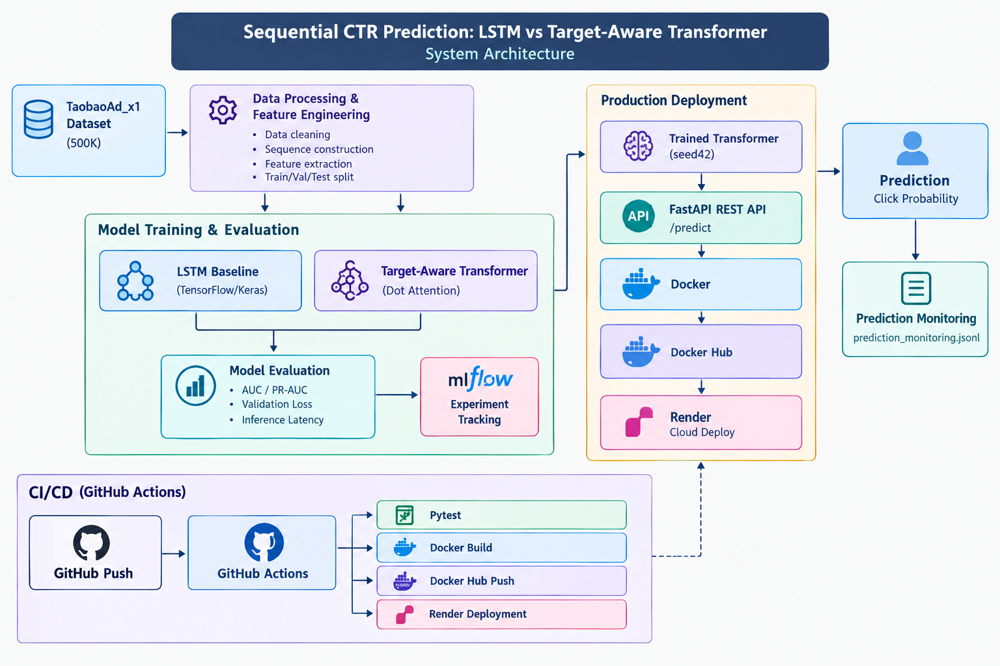

# Sequential CTR Prediction: LSTM vs Target-Aware Transformer

An end-to-end **Sequential Click-Through Rate (CTR) Prediction** system that predicts the probability of a user clicking an advertisement based on current ad features and historical user interaction sequences.

The project compares an **LSTM baseline** with a **Target-Aware Transformer** using TensorFlow/Keras and deploys the production Transformer model through **FastAPI, Docker, Docker Hub, Render, and GitHub Actions CI/CD**.

---

## 🚀 Project Overview

Traditional CTR models often treat user interactions independently. In this project, user behavior is represented as a sequence of historical interactions, allowing the models to learn patterns in user interests over time.

Two sequence models are implemented and evaluated:

* **LSTM** — sequential recurrent baseline
* **Target-Aware Transformer** — attention-based architecture that models the relationship between historical user behavior and the current target advertisement

The final system exposes a REST API that accepts user/ad features and returns a predicted click probability.

---

## 🎯 Objectives

* Build a sequential CTR prediction pipeline
* Compare LSTM and Transformer architectures
* Use historical user behavior for CTR prediction
* Evaluate models using AUC and PR-AUC
* Measure inference latency
* Track experiments using MLflow
* Build a production inference API using FastAPI
* Containerize the API using Docker
* Publish the Docker image to Docker Hub
* Automate testing and deployment using GitHub Actions
* Deploy the application to Render
* Add prediction monitoring for online inference

---

## 🏗️ System Architecture

The complete system architecture is shown below.



### Architecture Flow

```text
                         ┌──────────────────────┐
                         │  TaobaoAd_x1 Dataset │
                         │        500K          │
                         └──────────┬───────────┘
                                    │
                                    ▼
                     ┌────────────────────────────┐
                     │ Data Processing & Feature  │
                     │ Engineering                │
                     └─────────────┬──────────────┘
                                   │
                    ┌──────────────┴──────────────┐
                    │                             │
                    ▼                             ▼
          ┌──────────────────┐        ┌─────────────────────────┐
          │   LSTM Baseline  │        │ Target-Aware Transformer│
          │   TensorFlow     │        │     Dot Attention       │
          └────────┬─────────┘        └────────────┬────────────┘
                   │                               │
                   └──────────────┬────────────────┘
                                  ▼
                       ┌──────────────────────┐
                       │   Model Evaluation   │
                       │ AUC / PR-AUC / Loss  │
                       │ Inference Latency    │
                       └──────────┬───────────┘
                                  │
                                  ▼
                         ┌──────────────────┐
                         │     MLflow       │
                         │ Experiment       │
                         │ Tracking         │
                         └────────┬─────────┘
                                  │
                                  ▼
                     ┌────────────────────────┐
                     │ Production Transformer │
                     │         seed42          │
                     └────────────┬───────────┘
                                  │
                                  ▼
                       ┌─────────────────────┐
                       │    FastAPI REST     │
                       │       /predict      │
                       └──────────┬──────────┘
                                  │
                                  ▼
                            ┌───────────┐
                            │  Docker   │
                            └─────┬─────┘
                                  │
                                  ▼
                          ┌───────────────┐
                          │  Docker Hub   │
                          └───────┬───────┘
                                  │
                                  ▼
                           ┌────────────┐
                           │   Render   │
                           │    Cloud   │
                           └─────┬──────┘
                                 │
                                 ▼
                         ┌─────────────────┐
                         │   Prediction    │
                         └────────┬────────┘
                                  │
                                  ▼
                    ┌────────────────────────────┐
                    │   Prediction Monitoring    │
                    │ prediction_monitoring.jsonl│
                    └────────────────────────────┘
```

### CI/CD Flow

```text
Git Push
   │
   ▼
GitHub Actions
   │
   ├──► Install Dependencies
   │
   ├──► Run Pytest
   │
   ├──► Build Docker Image
   │
   ├──► Push Image to Docker Hub
   │
   └──► Trigger Render Deployment
```

---

## 📊 Model Comparison

Experiments were performed using multiple random seeds to evaluate model consistency.

| Model                    | Mean AUC | Mean PR-AUC | Mean Validation Loss |
| ------------------------ | -------: | ----------: | -------------------: |
| LSTM                     |   0.5962 |      0.0720 |               0.2068 |
| Target-Aware Transformer |   0.6018 |      0.0731 |               0.2128 |

The evaluated Transformer experiments achieved a higher mean AUC and mean PR-AUC than the evaluated LSTM experiments.

> **Note:** These metrics are based on the TaobaoAd_x1 500K subset used in this project and should not be interpreted as general performance guarantees on other datasets.

### Transformer Aggregate

* **Mean AUC:** 0.60184
* **Mean PR-AUC:** 0.07308
* **Mean inference latency:** 2.40 ms
* **Mean P95 latency:** 3.65 ms
* **Parameters:** 4,931,321
* **Model weights:** approximately 59.28 MB

### LSTM Aggregate

* **Mean AUC:** 0.59617
* **Mean PR-AUC:** 0.07198
* **Mean inference latency:** 4.00 ms
* **Mean P95 latency:** 6.33 ms
* **Parameters:** 4,910,585
* **Model weights:** approximately 58.97 MB

---

## 🧠 Models

### 1. LSTM Baseline

The LSTM model processes the user's historical interaction sequence sequentially and learns a hidden representation of previous user behavior.

Input features include:

* Advertisement ID
* Category ID
* Brand ID
* Price
* Historical categories
* Historical brands
* Historical behavioral tags

The learned representation is combined with the current advertisement information to generate the CTR prediction.

---

### 2. Target-Aware Transformer

The Target-Aware Transformer uses attention to model relationships between the user's historical interactions and the current target advertisement.

The architecture includes:

* Category embeddings
* Brand embeddings
* Behavioral tag embeddings
* Advertisement embeddings
* Dense feature representations
* Dot-product attention
* Transformer encoder layer
* Feed-forward network
* Dropout
* Final CTR prediction layer

The production model is:

```text
transformer_dot_L1_seed42
```

---

## 📚 Dataset

### TaobaoAd_x1

The project uses a **500K interaction subset** of the TaobaoAd_x1 dataset for model development and experimentation.

The dataset contains advertisement and user interaction information that can be represented as sequential behavior for CTR prediction.

The original raw dataset is **not included** in this repository.

---

## 🔧 Tech Stack

### Programming

* Python
* SQL

### Machine Learning

* TensorFlow
* Keras
* NumPy
* Pandas
* Scikit-learn

### Deep Learning

* LSTM
* Transformer
* Attention Mechanisms
* Embeddings

### API

* FastAPI
* Pydantic
* Uvicorn

### Experiment Tracking

* MLflow

### Deployment

* Docker
* Docker Hub
* Render

### CI/CD

* GitHub Actions
* Pytest

### Development

* Git
* GitHub
* VS Code

---

## 📁 Project Structure

```text
sequential-ctr-prediction/
│
├── .github/
│   └── workflows/
│       └── ci-cd.yml
│
├── data/
│   └── processed/
│       └── vocabularies_500k/
│
├── models/
│   ├── lstm.py
│   ├── transformer.py
│   └── transformer_dot_L1_seed42_500k_clean.weights.h5
│
├── scripts/
│   ├── train_lstm.py
│   ├── train_transformer.py
│   ├── evaluate_models.py
│   └── log_mlflow_results.py
│
├── src/
│   ├── features/
│   │   └── vocabulary.py
│   │
│   ├── monitoring/
│   │   └── prediction_monitor.py
│   │
│   └── serving/
│       └── app.py
│
├── tests/
│   └── test_api.py
│
├── system-architecture.png
├── Dockerfile
├── .dockerignore
├── .gitignore
├── .env.example
├── pyproject.toml
├── requirements.txt
└── README.md
```

---

## ⚙️ Installation

### Clone the Repository

```bash
git clone https://github.com/Nan2006-ditha/sequential-ctr-prediction.git
cd sequential-ctr-prediction
```

### Create a Virtual Environment

#### Windows

```powershell
python -m venv venv
.\venv\Scripts\Activate.ps1
```

### Install Dependencies

```powershell
pip install -r requirements.txt
```

---

## ▶️ Run the API Locally

Start FastAPI:

```powershell
uvicorn src.serving.app:app --reload
```

The API will be available at:

```text
http://127.0.0.1:8000
```

### Swagger Documentation

```text
http://127.0.0.1:8000/docs
```

### Health Endpoint

```text
GET /health
```

### Prediction Endpoint

```text
POST /predict
```

---

## 🔮 Prediction Example

### Request

```json
{
  "adgroup_id": 775579,
  "cate_id": 6261,
  "brand": 270915,
  "price": 0.14666666090488434,
  "cate_history": [],
  "brand_history": [],
  "btag_history": []
}
```

### Response

```json
{
  "click_probability": 0.03762187063694,
  "prediction": 0,
  "model": "transformer_dot_L1_seed42"
}
```

Where:

* `click_probability` is the predicted probability of a click
* `prediction = 1` when probability is greater than or equal to `0.5`
* `prediction = 0` otherwise

---

## 🐳 Docker

### Build the Docker Image

```powershell
docker build -t sequential-ctr-prediction:latest .
```

### Run the Container

```powershell
docker run -p 8000:8000 sequential-ctr-prediction:latest
```

The API can then be accessed at:

```text
http://localhost:8000/docs
```

---

## 📦 Docker Hub

Docker image:

```text
nandhitha2415/sequential-ctr-prediction:latest
```

### Pull the Image

```powershell
docker pull nandhitha2415/sequential-ctr-prediction:latest
```

### Run the Image

```powershell
docker run -p 8000:8000 nandhitha2415/sequential-ctr-prediction:latest
```

---

## ☁️ Cloud Deployment

The containerized FastAPI application is deployed on **Render**.

### Production API

```text
https://sequential-ctr-prediction-latest.onrender.com/
```

### Swagger Documentation

```text
https://sequential-ctr-prediction-latest.onrender.com/docs
```

### Health Check

```text
https://sequential-ctr-prediction-latest.onrender.com/health
```

---

## 🔄 CI/CD Pipeline

Every push to the `main` branch triggers the GitHub Actions CI/CD pipeline.

```text
Git Push
   │
   ▼
GitHub Actions
   │
   ▼
Install Dependencies
   │
   ▼
Run Pytest
   │
   ▼
Build Docker Image
   │
   ▼
Push Image to Docker Hub
   │
   ▼
Trigger Render Deployment
```

The pipeline automates:

* Dependency installation
* Automated testing
* Docker image building
* Docker Hub publishing
* Render deployment

---

## 📈 MLflow Experiment Tracking

MLflow is used to track experiments across multiple random seeds.

The following information is tracked:

* AUC
* PR-AUC
* Validation loss
* Inference latency
* P95 latency
* Number of parameters
* Model weight size
* Training time
* Best epoch
* Model type
* Framework
* Dataset

### Experiment Groups

```text
LSTM
 ├── seed 42
 ├── seed 43
 ├── seed 44
 └── aggregate

Transformer
 ├── seed 42
 ├── seed 43
 ├── seed 44
 └── aggregate
```

MLflow was used to compare experiments and maintain reproducible experiment metadata.

---

## 📡 Prediction Monitoring

The deployed API includes a lightweight prediction monitoring component.

For each prediction, the monitoring system records:

* Timestamp
* Prediction count
* Mean CTR probability
* Minimum probability
* Maximum probability
* Positive prediction rate

### Example

```json
{
  "timestamp": "2026-10-03T17:36:09.455974+00:00",
  "prediction_count": 1,
  "mean_ctr_probability": 0.03762187063694,
  "min_probability": 0.03762187063694,
  "max_probability": 0.03762187063694,
  "positive_prediction_rate": 0.0
}
```

Monitoring output is written to:

```text
logs/prediction_monitoring.jsonl
```

The `logs/` directory is excluded from Git tracking.

> For a larger production environment, monitoring data should be stored in a persistent logging, metrics, or monitoring system rather than relying on local container storage.

---

## 🧪 Testing

Run the test suite:

```powershell
pytest -q
```

The tests cover important API behavior, including:

* Prediction requests
* Input validation
* Invalid price handling
* API response behavior

---

## 🔐 Input Validation

The API validates:

* `price >= 0`
* Equal history lengths
* Valid request structure
* Supported input types

### Example Invalid Input

```json
{
  "adgroup_id": 775579,
  "cate_id": 6261,
  "brand": 270915,
  "price": -10,
  "cate_history": [],
  "brand_history": [],
  "btag_history": []
}
```

Returns:

```text
HTTP 422 Unprocessable Entity
```

---

## 📌 Key Features

| Feature             | Implementation             |
| ------------------- | -------------------------- |
| Sequential modeling | LSTM + Transformer         |
| Attention           | Target-aware dot attention |
| Dataset             | TaobaoAd_x1 500K           |
| Framework           | TensorFlow/Keras           |
| API                 | FastAPI                    |
| Validation          | Pydantic                   |
| Experiment tracking | MLflow                     |
| Containerization    | Docker                     |
| Image registry      | Docker Hub                 |
| Cloud deployment    | Render                     |
| Testing             | Pytest                     |
| CI/CD               | GitHub Actions             |
| Monitoring          | JSONL prediction logging   |

---

## 💡 What I Learned

This project provided hands-on experience across the complete machine learning lifecycle:

1. Dataset preprocessing
2. Sequential feature engineering
3. LSTM modeling
4. Transformer architecture
5. Attention mechanisms
6. Model evaluation
7. MLflow experiment tracking
8. REST API development
9. Docker containerization
10. Cloud deployment
11. Automated CI/CD
12. Prediction monitoring

---

## 🔮 Future Improvements

* Real-time feature ingestion using Kafka
* Persistent monitoring using Prometheus/Grafana
* Model and data drift detection
* Automated model retraining
* Feature store integration
* More advanced target-aware attention architectures
* Larger-scale dataset training
* A/B testing of model versions
* Persistent cloud-based MLflow tracking

---

## 👩‍💻 Author

**Nandhitha Sri Maraka**

B.Tech Computer Science Engineering
GITAM University, Bengaluru

**GitHub:**
https://github.com/Nan2006-ditha

**LinkedIn:**
https://www.linkedin.com/in/nandhitha-maraka-905678293/

---

## ⭐ Project Summary

**Sequential CTR Prediction** demonstrates an end-to-end machine learning workflow for predicting advertisement click probability from sequential user behavior.

The project combines:

* Deep learning
* Sequential modeling
* Transformer attention
* Experiment tracking
* REST API development
* Docker containerization
* Cloud deployment
* Automated CI/CD
* Prediction monitoring

into a single production-oriented machine learning system.
